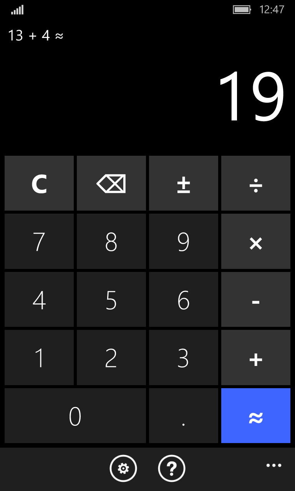
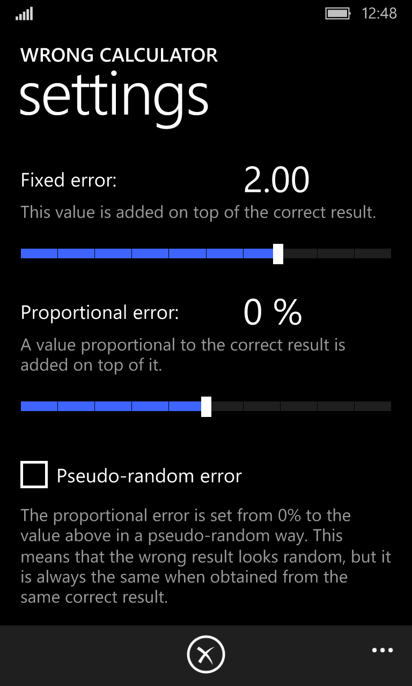
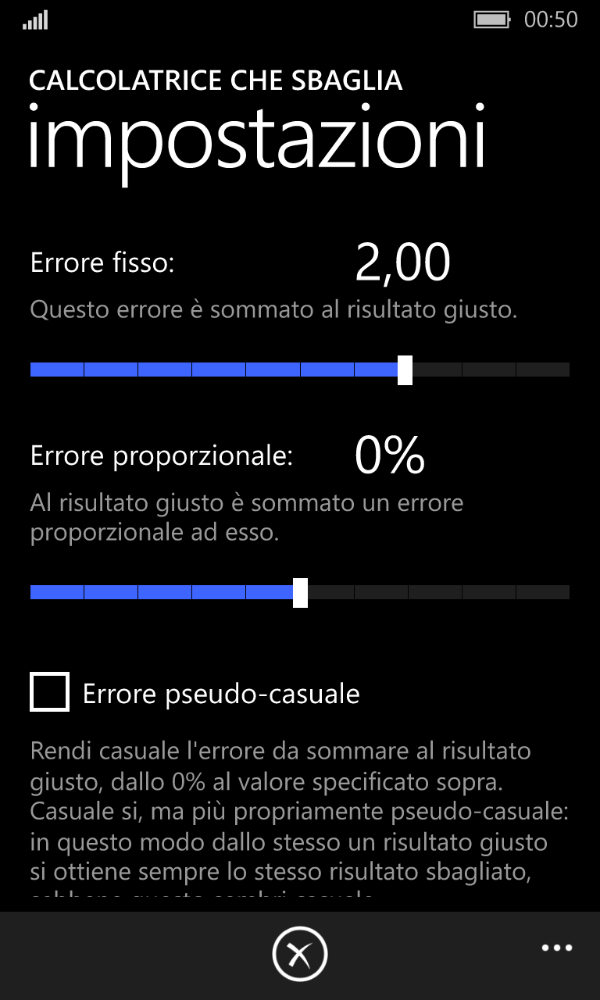
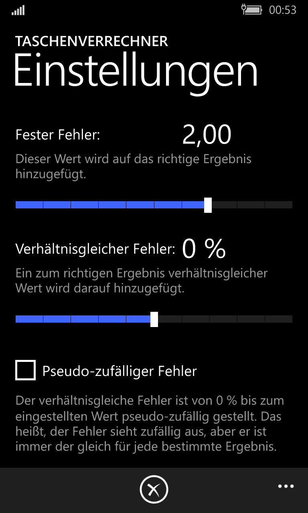

# Buggy Calculator

This is a repository containing the sources of the "Buggy Calculator" application
I developed in 2015 as one of my first, demo Windows Phone app, developed while working at Nokia.

It's a multilanguage app and has therefore multiple names:

- Buggy Calculator -or- Wrong Calculator
- Calcolatrice che sbaglia
- Taschenverrechner

I uploaded it in 2020 to GitHub to save this relic.

## Description

*English:*

    Who does not need a calculator that gives wrong results?

    Sooner or later everybody need to round or adjust the result of a calculation to their advantage,
    like when splitting the bill of a restaurant between true and loyal friends, or to trick one of them
    who still does not want to believe that 17 - 4 is actually 12.

    This app is made explicitly for these purposes. Just configure the behavior in the settings page
    and a predictable error is applied to the result of every calculation.

    Please enjoy responsibly.

*Italian:*

    Chi non ha mai avuto bisogno di una calcolatrice che sbagli i calcoli?

    Prima o poi tutti hanno bisogno di arrotondare o "perfezionare" il risultato di un calcolo a loro vantaggio,
    come ad esempio al momento di divedere il conto fra un gruppo di amici veri e leali,
    oppure per convincere uno di loro che si ostina a non credere che 17 - 4 faccia veramente 12.

    Questa app è stata sviluppata esplicitamente per questi scopi. Basta configurarne
    il comportamento nelle impostazioni e l'errore desiderato verrà applicato automaticamente
    a ogni risultato calcolato.

    Fatene un uso responsabile.

*German:*

    Wer braucht keinen Taschenrechner, der sich verrechnet?

    Früher oder später müssen alle das Ergebnis einer Berechnung zu ihrem Vorteil auf- oder abrunden.
    Zum Beispiel in einem Restaurant zusammen mit wahren und treuen Freunden oder
    einen davon endlich überzeugen, dass 17 - 4 tatsächlich 12 macht.

    Diese App wurde explizit für diese besondere Zwecke entwickelt. Einfach das Verhalten des Taschenrechners
    einstellen und vorhersehbare Fehler werden an das Ergebnis jeder Berechnung angewendet.

    Bitte bewusst genießen.

## Screenshots

## On Microsoft Store

At the time of writing, the app is still available on Microsoft Store at this URL:

https://www.microsoft.com/store/apps/9NBLGGH1MVVG

It should be available in selected countries. It requires a device with Windows Phone 8 or 10.
It's clearly deprecated, as both the operating systems are now deprecated by Microsoft.
